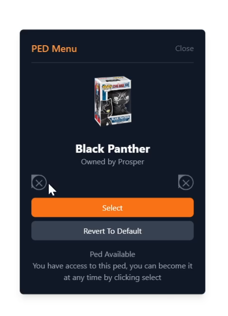

# SvelteKit-PedMenu

Welcome to SvelteKit-PedMenu, a fantastic project that leverages the power of SvelteKit! 🚀

 <!-- Update this path based on where you save the image -->

## Getting Started

Follow these steps to kickstart your Phans-Permissions experience:

1. Clone this repository to your local machine:

    ```bash
    git clone https://github.com/ProsperXD/SvelteKit_PedMenu.git
    ```

2. Dive into the project directory:

    ```bash
    cd SvelteKit_PedMenu
    ```

3. Run these commands in the terminal:

    ```bash
    pnpm i && code . && pnpm dev
    ```

4. Start exploring and customizing your Phans-Permissions experience!

## Features

- **Awesome Feature 1**: Uses Table To Format Peds.
- **Amazing Feature 2**: Uses Cool Featured Design.
- **Amazing Feature 3**: Token Redeem Peds.

## License

This project is licensed under the [MIT License](LICENSE.md).

Happy coding! 🎉
